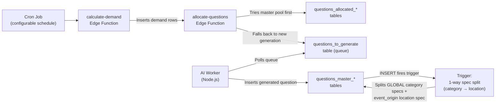
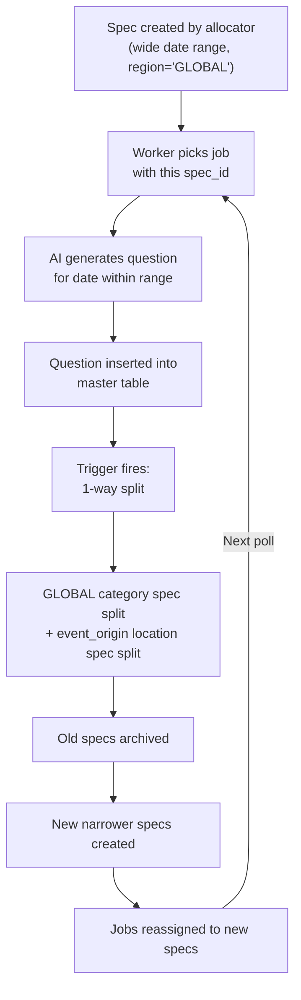

# Elementle — Question Generation Workflow

> **Purpose:** Complete technical reference for the question generation system. Contains sufficient detail for a development team to recreate the entire pipeline from scratch.
> 
> **Last updated:** 2026-03-13 (Post-Phase 3 Global Architecture Migration)

---

## Table of Contents

1. [System Overview](#1-system-overview)
2. [Database Schema](#2-database-schema)
3. [Location Allocation Pipeline](#3-location-allocation-pipeline)
4. [Demand Calculation](#4-demand-calculation)
5. [Question Allocation](#5-question-allocation)
6. [AI Worker & Spec Rotation](#6-ai-worker--spec-rotation)
7. [Spec Splitting & Anti-Duplication](#7-spec-splitting--anti-duplication)
8. [Cron Jobs & Scheduling](#8-cron-jobs--scheduling)
9. [League & Timezone Handling](#9-league--timezone-handling)
10. [Configuration Reference](#10-configuration-reference)
11. [Reference Tables](#11-reference-tables)
12. [AI Prompt Design](#12-ai-prompt-design)

---

## 1. System Overview

The question generation system is a multi-stage pipeline that ensures every user has a daily quiz question available. It operates across two scopes with three game modes:

| Scope | Game Mode | Description | Master Table | Allocation Table |
|---|---|---|---|---|
| **Region** | **Global** | Shared questions for ALL users worldwide (`region='GLOBAL'`) | `questions_master_region` | `questions_allocated_region` |
| **User** | **Personal** | Personalised questions per user (location + category mix, branded as "{Country} Edition") | `questions_master_user` | `questions_allocated_user` |

### High-Level Flow



### Entry Points

The pipeline can be triggered in three ways:
1. **Cron job** (`elementle_demand`): Runs on a configurable schedule. Calls `calculate-demand` for all users + region `GLOBAL`.
2. **User-scoped**: When a user changes their postcode, preferences, or subscription tier. Calls `calculate-demand` with `user_id` param.
3. **Re-calculation loop**: When the last job in a demand scope completes, `finalizeScopeCheck` in the worker re-triggers `calculate-demand` to check if more demand exists.

---

## 2. Database Schema

### 2.1 Core Tables

#### `populated_places`
Physical locations sourced from OS OpenData (UK Ordnance Survey). Each place has a type, geometry, and active flag. **Only used for Tier 1 (UK) location questions.**

| Column | Type | Description |
|---|---|---|
| `id` | text (PK) | OS data ID (e.g., `osgb4000000074571804`) |
| `name1` | text | Primary place name |
| `name2` | text | Secondary name (optional) |
| `local_type` | text | One of: `Hamlet`, `Village`, `Town`, `City` |
| `postcode_district` | text | e.g., `SW1` |
| `geom` | geometry(Point,4326) | PostGIS point |
| `active` | boolean | Whether questions can still be generated for this place |
| `total_questions` | integer | Count of questions generated for this place |

#### `location_allocation`
Maps users to their assigned places. Each user gets up to 10 places, scored by proximity and place size. **Only populated for UK users with postcodes.**

| Column | Type | Description |
|---|---|---|
| `id` | bigserial (PK) | Auto-incrementing ID |
| `user_id` | uuid (FK → `user_profiles`) | The user |
| `location_id` | text (FK → `populated_places`) | The assigned place |
| `score` | numeric | `sizePoints(size_category) × (1 / distance_in_miles)` |
| `allocation_active` | boolean | Whether this allocation is active |

#### `available_question_spec`
Defines date ranges within which the AI can generate questions. Prevents duplicate events by splitting ranges.

| Column | Type | Description |
|---|---|---|
| `id` | bigserial (PK) | Auto-incrementing ID |
| `start_date` | date | Start of available date range |
| `end_date` | date | End of range (`9999-01-01` = sentinel for "up to today") |
| `region` | text | `'GLOBAL'` for shared category specs, ISO country code for location specs (e.g., `'PT'`, `'FR'`, `'US-TX'`) |
| `location` | text (FK → `populated_places`, nullable) | For UK location specs (category_id=999) |
| `category_id` | integer (FK → `categories`) | Category (999 = Local History / location questions) |
| `active` | boolean | Whether this spec is usable |
| `date_range` | daterange (GENERATED) | Computed from `start_date` and `end_date` |
| `deactivate_reason` | text | Why spec was deactivated |

**Key change (Phase 3):** Category specs now use `region = 'GLOBAL'` (single shared timeline for all users). Location specs use the event's origin country code (e.g., `'FR'`, `'PT'`, `'US-TX'`).

#### `questions_to_generate`
The generation queue. Jobs are inserted by the allocator and polled by the AI worker.

| Key Columns | Description |
|---|---|
| `scope_type` | `'region'` or `'user'` |
| `scope_id` | `'GLOBAL'` (region scope) or user UUID (user scope) |
| `puzzle_date` | The date this question is being generated for |
| `slot_type` | `'category'` or `'location'` |
| `category_id` | Category (or 999 for location) |
| `populated_place_id` | Place ID (for UK location slots only) |
| `spec_id` | FK → `available_question_spec` |
| `status` | `'pending'`, `'retry'`, `'processing'`, `'failed'` |
| `priority` | 1 (today) → 4 (14+ days out) |

#### `questions_master_region` / `questions_master_user`
Stores the generated questions.

| Key Columns | Description |
|---|---|
| `id` | bigserial (PK) |
| `answer_date_canonical` | The historical date of the event |
| `event_title` | Short event title (≤50 chars) |
| `event_description` | Full event description (≤200 chars) |
| `regions` | jsonb — `["ALL"]` for region-scope, `["UK"]`/`["US"]`/`["ALL"]` for user-scope |
| `event_origin` | text — ISO 2-letter country code where event occurred (e.g., `'FR'`, `'US'`, `'UK'`). Convention uses `'UK'` not `'GB'` |
| `categories` | jsonb — Array of category IDs (up to 3) |
| `question_kind` | `'category'` or `'location'` |
| `populated_place_id` | FK → `populated_places` (for UK location questions) |
| `quality_score` | 1–5 AI self-assessment (floor: must be ≥3) |
| `accuracy_score` | 1–5 AI self-assessment |
| `ai_model_used` | e.g., `'gpt-4o'` |
| `is_approved` | boolean — always `true` for new questions |
| `target_sphere` | text — Cultural sphere code (`ANG`/`ELA`/`ASI`/`SAM`/`AFR`) or null |
| `excluded_spheres` | jsonb — Array of sphere codes that would not know this event |

**Triggers on INSERT:**
- `questions_master_region` → `trg_split_region_specs()` 
- `questions_master_user` → `trg_split_user_specs()`

These perform **1-way cross-scope splitting**: category question insertion splits GLOBAL category specs AND the event_origin's location spec.

#### `questions_allocated_region` / `questions_allocated_user`
Maps generated questions to specific puzzle dates.

| Key Columns | Description |
|---|---|
| `puzzle_date` | Date the user will play this question |
| `question_id` | FK → master table |
| `region` | `'GLOBAL'` for region allocations |
| `slot_type` | `'category'` or `'location'` |
| `category_id` | Category of the allocated question |
| `trigger_reason` | Why this allocation was created |

### 2.2 Configuration Tables

#### `question_generation_settings`
Controls demand windows and thresholds per scope type and tier.

| `scope_type` | `tier` | `demand_type` | `min_threshold` | `target_topup` | `seed_amount` |
|---|---|---|---|---|---|
| user | standard | future | 7 | 7 | 14 |
| user | pro | future | 21 | 7 | 28 |
| user | standard | archive | 0 | 0 | 14 |
| user | pro | archive | 60 | 30 | 90 |
| region | NULL | future | 30 | 30 | 60 |
| region | NULL | archive | 60 | 60 | 200 |

#### `demand_scheduler_config`

| Column | Current Value | Description |
|---|---|---|
| `start_time` | `'01:00'` | UTC time for the first daily run |
| `frequency_hours` | `8` | Hours between runs (3× daily: 01:00, 09:00, 17:00 UTC) |

#### `categories`
21 categories (IDs 10–29 + 999). Category 999 = "Local History" sentinel for location questions only.

---

## 3. Location Allocation Pipeline

### 3.1 Overview: 3 Tiers of Location Questions

| Tier | Country | Method | Spec Format |
|---|---|---|---|
| **Tier 1: UK** | UK users with postcode | PostGIS geocoding → top 10 nearby places | `category_id=999, location=place_id` |
| **Tier 2: US** | US users | State from `user_profiles.sub_region` (e.g., `US-TX`) | `category_id=999, region='US-TX', location=NULL` |
| **Tier 3: ROW** | All other countries | Country from `user_profiles.region` (e.g., `FR`) | `category_id=999, region='FR', location=NULL` |

### 3.2 Tier 1: UK Postcode Flow

When a UK user enters their postcode:
1. `geocode_postcode` Edge Function calls `postcodes.io` API for lat/lng
2. `get_nearby_locations` RPC finds places within 20 miles (PostGIS)
3. Score each: `sizePoints(size_category) × (1 / distance_miles)`
4. Insert top 10 into `location_allocation`

### 3.3 Place Deactivation & Reallocation

When all date ranges for a place are exhausted:
1. `archive_and_delete_spec` sets `populated_places.active = false`
2. Trigger fires `reallocate_jobs_for_inactive_place()`
3. Pending jobs are reassigned to the user's next-best-scored active place

---

## 4. Demand Calculation

### 4.1 Overview

The `calculate-demand` Edge Function determines what questions need to be generated or allocated. It writes rows into `demand_summary` and then immediately calls `allocate-questions`.

### 4.2 Scoping Modes

| Mode | Trigger | Region Default |
|---|---|---|
| **Global** | Cron job (no params) | `regionIds = ["GLOBAL"]` |
| **User-scoped** | `{ user_id: "..." }` | Single user only |
| **Region-scoped** | `{ region: "GLOBAL" }` | Single region |

### 4.3 User Future & Archive Demand

Uses `user_future_demand()` / `user_archive_demand()` RPCs:
- Check if allocated dates cover the required window
- If gaps found → write demand rows to `demand_summary`
- Standard users: 7-day future window, 14-day seed
- Pro users: 21-day future window, 90-day archive seed

### 4.4 Region Demand

Processes `region='GLOBAL'` demand:
- 30-day future rolling window, 200-day archive seed
- Allocates from `questions_master_region` pool or creates generation jobs

### 4.5 Failsafe: 3-Day Future Check

On global runs, ensures **every user** has the next 3 days covered (priority-0).

---

## 5. Question Allocation

### 5.1 Overview

The `allocate-questions` Edge Function processes pending demand rows:
- **Directly allocates** existing master questions, or
- **Creates generation jobs** in `questions_to_generate`

### 5.2 Region Allocation Branch

When `scope_type = 'region'` (i.e., GLOBAL game):

1. Load master pool from `questions_master_region` (quality_score ≥ 3)
2. Exclude already-allocated questions
3. Balance by category (round-robin, 14-day lookback)
4. For each missing date:
   - Pick category → try master pool → if found, allocate with `slot_type = 'category'`
   - If no master available → look up/create specs (`region='GLOBAL'`) → push generation job

**Auto-create failsafe:** If a new category has no specs, the allocator creates 8 initial specs with `region = 'GLOBAL'` (hardcoded).

### 5.3 User Allocation Branch

When `scope_type = 'user'`:

#### Slot Plan: `buildUserSlotPlan()`
- Target ratio: 1/3 location, 2/3 category
- Today's date always forced to location slot
- If user has no active locations → all slots become category
- PRO users with preferences → distribute across selected categories
- Non-PRO → round-robin through all categories

#### Per-Date Allocation
- **Location slot:** Select place → try master → if not found, push job with `category_id=999`
- **Category slot:** Select category → try master → if not found, push job with spec

**Auto-create failsafe:** Category specs default to `region = 'GLOBAL'` (not the user's region).

---

## 6. AI Worker & Spec Rotation

### 6.1 Worker Architecture

The AI worker (`elementle-worker/index.js`) is a Node.js process that:
1. Polls `questions_to_generate` for pending/retry jobs (prioritized by priority, oldest first)
2. Claims a job by setting `status = 'processing'`
3. Fetches the associated spec for date range constraints
4. Builds a scope-aware AI prompt (see §12)
5. Calls GPT-4o to generate a historical event question
6. Validates: date in range, no duplicates, quality ≥ 3, accuracy checks
7. **Verifies** via second AI call (see §6.4)
8. Sanitises metadata: GB→UK mapping, sphere validation
9. Inserts into the appropriate master table with hardcoded metadata for region scope
10. Archives the job

### 6.2 Spec Lifecycle



### 6.3 Quality & Accuracy Gating

The worker enforces multiple quality gates before accepting a generated question:

| Gate | Condition | Action |
|---|---|---|
| **Accuracy floor** | `accuracy_score < 3` | Reject, deactivate spec, fail job |
| **Quality floor** | `quality_score < 3` | Reject, deactivate spec, fail job |
| **Low quality retry** | `quality_score < 3` and `attempts < 2` | Retry (continue loop) |
| **Verification** | `accuracy_score >= 3 && < 5` | Pass through secondary verifier AI |

### 6.4 Secondary Verification (Verifier AI)

For questions with accuracy 3–4, a second AI call (`verifyEventCandidate`) is made:

**Inputs:** The candidate question JSON + `job.scope_id`

**Verifier checks:**
1. Whether the event actually occurred (`verdict: confirm/hallucination/corrected`)
2. Whether the date is accurate (`accuracy_score`)
3. **National First detection** (GLOBAL scope only): Is this merely a national/regional first? (`is_strictly_national_first: boolean`)
4. Suspicious 1st January dates

**Actions on verifier response:**
| Verdict | Action |
|---|---|
| `hallucination` | Reject, retry (deactivate spec after 2 attempts) |
| `is_strictly_national_first === true` (GLOBAL only) | Reject, retry (deactivate with reason `national_first_rejected`) |
| `corrected` | Apply corrections, re-check date range |
| `confirm` | Accept (with verifier's accuracy score) |
| Verifier accuracy ≤ 3 | Reject, retry |

### 6.5 INSERT Payload

#### Region-scope questions (`questions_master_region`):
Metadata is **hardcoded** (not from AI):
- `regions: ["ALL"]`
- `target_sphere: null`
- `excluded_spheres: []`
- `is_approved: true`
- `event_origin`: from AI, with `GB` → `UK` mapping

#### User-scope questions (`questions_master_user`):
- `regions`: from AI for category questions, `[scope_id]` otherwise
- `target_sphere`: from AI, validated against `VALID_SPHERES` (ANG/ELA/ASI/SAM/AFR)
- `excluded_spheres`: from AI
- `is_approved: true`
- `event_origin`: from AI, with `GB` → `UK` mapping

### 6.6 Worker Failure Recovery

Failed jobs cycle through `archive_and_delete_spec` → detach → find replacement spec → reassign with different date range. This creates a **self-healing loop** across all available time periods.

---

## 7. Spec Splitting & Anti-Duplication

### 7.1 One-Way Cross-Scope Splitting (Phase 3)

When a **category** question is inserted into either master table, the trigger performs:

**Step 1 — Category spec split (GLOBAL):**
For each category in `NEW.categories` (excluding 999):
- Find the covering GLOBAL spec: `region='GLOBAL', category_id=X, active=true`
- Split at `event_date`: create LEFT `[start, event_date-1]` and RIGHT `[event_date+1, end]` children
- Archive the parent spec

**Step 2 — Location spec split (1-way, by event_origin):**
- Uses `NEW.event_origin` to determine which country's location timeline to split
- **Rules:**
  - `event_origin = 'UK'` or `'US'` → **NO location split** (country-level events don't block hyper-local questions)
  - `event_origin = 'FR'`, `'PT'`, `'NL'`, etc. (ROW) → Split `region='{origin}', category_id=999` spec at event_date
  - `event_origin = 'WW'` → **NO location split** (removed — global events don't block local questions)
  - US state codes (e.g., `'US-TX'`) → Split the state's location spec

**Why one-way?** A category question about the Battle of Waterloo should prevent a Belgium location question on the same date. But a hyper-local hamlet event should NOT block a globally-shared category spec.

### 7.2 Split Threshold

Splits are skipped if the resulting child spec would be ≤3 days from the boundary (too narrow to be useful).

### 7.3 Worker-Side Splitting

When the AI generates a question for a date that already has an existing question (duplicate detection), the worker calls `split_spec_and_reset_job()` to split the spec inline and retry with a different date range.

---

## 8. Cron Jobs & Scheduling

### 8.1 All Active Cron Jobs

| Job Name | Schedule (UTC) | Function |
|---|---|---|
| `elementle_demand` | Configurable (currently every 8 hours) | `calculate-demand` via `pg_net` |
| `league-snapshot-every-30m` | `*/30 * * * *` | `process_pending_snapshots()` |
| `daily-league-standings-decay` | `5 0 * * *` | `refresh_all_active_league_standings()` |
| Monthly/Yearly award jobs | 1st of month/year | Snapshots, awards, badges, cleanup |

### 8.2 Dynamic Scheduling

`demand_scheduler_config` controls the cron: `frequency_hours = 8` means runs at 01:00, 09:00, 17:00 UTC — covers midnight windows for all major timezone groups.

---

## 9. League & Timezone Handling

### 9.1 `region_to_timezone()` Function

Maps region codes to IANA timezone strings. Currently a hardcoded CASE statement:

```sql
CASE UPPER(COALESCE(p_region, ''))
  WHEN 'UK'     THEN 'Europe/London'
  WHEN 'US'     THEN 'America/New_York'
  WHEN 'AU'     THEN 'Australia/Sydney'
  WHEN 'GLOBAL' THEN 'Etc/GMT+12'
  ELSE 'Etc/GMT+12'
END
```

> **Future:** Replace with lookup from `reference_countries` table + `user_profiles.timezone` (from `expo-localization`).

### 9.2 `process_pending_snapshots()`

Uses `COALESCE(up.region, 'GLOBAL')` for timezone lookup (defaulting to `'GLOBAL'` instead of the old `'UK'`).

### 9.3 `refresh_all_active_league_standings()`

Same `COALESCE(up.region, 'GLOBAL')` pattern for timezone.

---

## 10. Configuration Reference

### 10.1 Constants

| Constant | Value | Location |
|---|---|---|
| `MAX_RADIUS_MILES` | 20 | `geocode_postcode` |
| Top locations per user | 10 | `geocode_postcode` |
| Location:Category ratio | 1:2 (≈33% location) | `buildUserSlotPlan` |
| Category spec splits | 8 ranges | `allocate-questions` |
| Location spec splits | 2 ranges | `allocate-questions` |
| Split threshold | ≤3 days from boundary | Trigger functions |
| Quality floor | ≥3 | Worker (reject + deactivate) |
| Accuracy floor | ≥3 | Worker (reject + deactivate) |

### 10.2 Edge Functions

| Function | Purpose |
|---|---|
| `calculate-demand` | Determines question demand for users + GLOBAL region |
| `allocate-questions` | Allocates questions or creates generation jobs |
| `geocode_postcode` | Geocodes UK postcode, sets up location allocations |
| `reset-and-reallocate-user` | Clears unplayed allocations |
| `update-demand-schedule` | Updates cron schedule dynamically |

### 10.3 Key Triggers

| Trigger | Table | Event | Action |
|---|---|---|---|
| `trg_split_region_specs` | `questions_master_region` | AFTER INSERT | 1-way split: GLOBAL category specs + event_origin location spec |
| `trg_split_user_specs` | `questions_master_user` | AFTER INSERT | Same 1-way split logic |
| `trg_archive_inactive_spec` | `available_question_spec` | AFTER UPDATE OF `active` | Archive + delete spec |
| `place_deactivate_reallocate` | `populated_places` | AFTER UPDATE OF `active` | Reallocate jobs |

---

## 11. Reference Tables

### 11.1 `reference_countries`

| Column | Type | Description |
|---|---|---|
| `code` | text (PK) | ISO 2-letter code (`'UK'` for United Kingdom, NOT `'GB'`) |
| `name` | text | Full country name |
| `display_name` | text | User-facing display name |
| `prompt_name` | text | Name used in AI prompts |
| `continent` | text | Continent name |
| `timezone` | text | IANA timezone (e.g., `'Europe/Paris'`) |
| `cultural_sphere_code` | text | One of: `ANG`, `ELA`, `ASI`, `SAM`, `AFR` |
| `active` | boolean | Whether questions are generated for this country |

### 11.2 `reference_us_states`

| Column | Type | Description |
|---|---|---|
| `code` | text (PK) | e.g., `'US-TX'` |
| `name` | text | Full state name |
| `display_name` | text | Display name |
| `prompt_name` | text | AI prompt name |

### 11.3 Cultural Spheres

| Code | Name | Examples |
|---|---|---|
| `ANG` | Anglosphere | US, UK, CA, AU, NZ, IE |
| `ELA` | Euro-LatAm | FR, DE, ES, IT, BR, AR, MX |
| `ASI` | East & Southeast Asia | JP, CN, KR, TH, VN, SG |
| `SAM` | South Asia & MENA | IN, PK, BD, SA, AE, EG |
| `AFR` | Sub-Saharan Africa | NG, ZA, KE, GH, ET |

---

## 12. AI Prompt Design

### 12.1 GLOBAL Game (Region Scope, `scope_id='GLOBAL'`)

- Asks for "truly worldwide, universally recognised" events
- **CRITICAL rule:** No "National Firsts" — must be a World First if it's a "first" event
- No `universalMetadataBlock` — metadata is hardcoded at INSERT time
- AI returns: `event_title`, `event_description`, `answer_date_canonical`, `categories`, `quality_score`, `accuracy_score`, `event_origin`

### 12.2 Country-Specific Region (e.g., legacy UK/US region games)

- Asks for events "relevant to {country}" audience
- Same output fields as GLOBAL (no sphere/regions metadata needed)

### 12.3 User-Scope Category Questions

- Includes `universalMetadataBlock` for sphere/regions metadata
- AI returns additional fields: `regions`, `target_sphere`, `excluded_spheres`

### 12.4 User-Scope Location Questions (3 Variants)

| Tier | Prompt Focus |
|---|---|
| **UK** | "Event relevant to {place_name}, a {local_type} in {postcode_district}" |
| **US State** | "Event relevant to a specific region/city within {state_name}, United States" |
| **ROW** | "Event relevant to a specific region/city within {country_name}" |

### 12.5 Verifier (Secondary AI)

- Receives candidate JSON + scope context
- Returns: `verdict`, `rationale`, `accuracy_score`, corrected fields, `is_strictly_national_first`
- For GLOBAL scope: explicitly checks whether event is a National First
