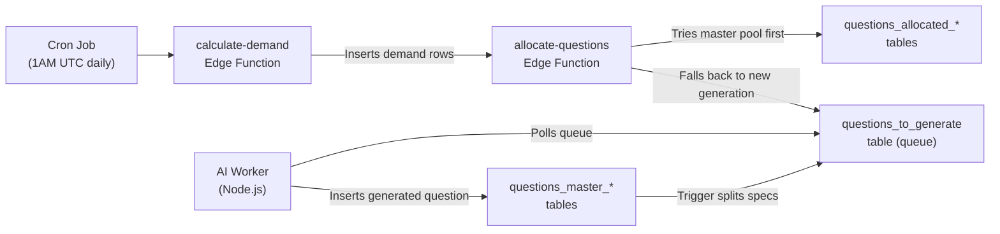
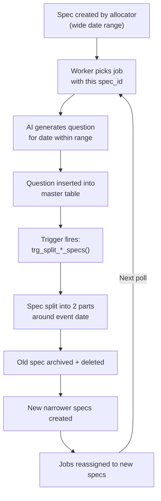

# Elementle — Question Generation Workflow

> **Purpose:** Complete technical reference for the question generation system. Contains sufficient detail for a development team to recreate the entire pipeline from scratch.

---

## Table of Contents

1. [System Overview](#1-system-overview)
2. [Database Schema](#2-database-schema)
3. [Location Allocation Pipeline](#3-location-allocation-pipeline)
4. [Demand Calculation](#4-demand-calculation)
5. [Question Allocation](#5-question-allocation)
6. [AI Worker & Spec Rotation](#6-ai-worker--spec-rotation)
7. [Spec Splitting & Anti-Duplication](#7-spec-splitting--anti-duplication)
8. [Cron Jobs & Scheduling](#8-cron-jobs--scheduling)
9. [League & Timezone Handling](#9-league--timezone-handling)
10. [Configuration Reference](#10-configuration-reference)

---

## 1. System Overview

The question generation system is a multi-stage pipeline that ensures every user has a daily quiz question available. It operates across three scopes:

| Scope | Description | Master Table | Allocation Table |
|---|---|---|---|
| **Region** | Shared questions for all users in a region (e.g., UK) | `questions_master_region` | `questions_allocated_region` |
| **User** | Personalised questions per user (location + category mix) | `questions_master_user` | `questions_allocated_user` |
| **Global** | (Planned) Internationally diverse questions | — | — |

### High-Level Flow



### Entry Points

The pipeline can be triggered in three ways:
1. **Cron job** (`elementle_demand`): Runs on a configurable schedule (currently daily at 1AM UTC). Calls `calculate-demand` for all users + region.
2. **User-scoped**: When a user changes their postcode, preferences, or subscription tier. Calls `calculate-demand` with `user_id` param.
3. **Re-calculation loop**: When the last job in a demand scope completes, `finalizeScopeCheck` in the worker re-triggers `calculate-demand` to check if more demand exists.

---

## 2. Database Schema

### 2.1 Core Tables

#### `populated_places`
Physical locations sourced from OS OpenData (UK Ordnance Survey). Each place has a type, geometry, and active flag.

| Column | Type | Description |
|---|---|---|
| `id` | text (PK) | OS data ID (e.g., `osgb4000000074571804`) |
| `name1` | text | Primary place name |
| `name2` | text | Secondary name (optional) |
| `local_type` | text | One of: `Hamlet`, `Village`, `Town`, `City` |
| `postcode_district` | text | e.g., `SW1` |
| `geom` | geometry(Point,4326) | PostGIS point |
| `active` | boolean | Whether questions can still be generated for this place |
| `total_questions` | integer | Count of questions generated for this place |

**Trigger:** `place_deactivate_reallocate` — AFTER UPDATE OF `active`. When a place is deactivated (`active = false`), calls `reallocate_jobs_for_inactive_place()`.

#### `location_allocation`
Maps users to their assigned places. Each user gets up to 10 places, scored by proximity and place size.

| Column | Type | Description |
|---|---|---|
| `id` | bigserial (PK) | Auto-incrementing ID |
| `user_id` | uuid (FK → `user_profiles`) | The user |
| `location_id` | text (FK → `populated_places`) | The assigned place |
| `score` | numeric | Computed as `sizePoints(size_category) × (1 / distance_in_miles)` |
| `allocation_active` | boolean | Whether this allocation is still active for the user |
| `questions_allocated` | integer | Count of questions allocated to this user for this place |
| `created_at` | timestamptz | When allocated |
| `updated_at` | timestamptz | Last modified |

**Unique constraint:** `(user_id, location_id)`

**Audit:** All changes are logged to `location_allocation_audit` via `trg_log_location_allocation_changes` trigger on INSERT, UPDATE, DELETE.

#### `available_question_spec`
Defines date ranges within which the AI can generate questions. Prevents duplicate events by splitting ranges when a question is generated.

| Column | Type | Description |
|---|---|---|
| `id` | bigserial (PK) | Auto-incrementing ID |
| `start_date` | date | Start of available date range |
| `end_date` | date | End of range (use `9999-01-01` as sentinel for "up to today") |
| `region` | text | Region code (currently always `'UK'`) |
| `location` | text (FK → `populated_places`, nullable) | For location specs (category_id=999) |
| `category_id` | integer (FK → `categories`) | Category for this spec (999 = Local History) |
| `active` | boolean | Whether this spec is usable |
| `date_range` | daterange (GENERATED) | Computed from `start_date` and `end_date` |
| `deactivate_reason` | text | Why spec was deactivated |

**Trigger:** `trg_archive_inactive_spec` — AFTER UPDATE OF `active`. When `active` becomes `false`, calls `archive_and_delete_spec()`.

#### `questions_to_generate`
The generation queue. Jobs are inserted by the allocator and polled by the AI worker.

| Key Columns | Description |
|---|---|
| `scope_type` | `'region'` or `'user'` |
| `scope_id` | Region code or user UUID |
| `puzzle_date` | The date this question is being generated for |
| `slot_type` | `'category'` or `'location'` |
| `category_id` | Category (or 999 for location) |
| `populated_place_id` | Place ID (for location slots only) |
| `spec_id` | FK → `available_question_spec` |
| `status` | `'pending'`, `'retry'`, `'processing'`, `'failed'` |
| `priority` | 1 (today) → 4 (14+ days out) |

#### `questions_master_region` / `questions_master_user`
Stores the generated questions.

| Key Columns | Description |
|---|---|
| `id` | bigserial (PK) |
| `answer_date_canonical` | The historical date of the event |
| `event_title` | Short event title |
| `event_description` | Full event description |
| `regions` | jsonb — Array of region codes (currently always `'["UK"]'`) |
| `event_origin` | text — Country where event occurred (currently inconsistent full names) |
| `categories` | jsonb — Array of category IDs |
| `question_kind` | `'category'` or `'location'` |
| `populated_place_id` | FK → `populated_places` (for location questions) |
| `quality_score` | 1–5 AI self-assessment |
| `accuracy_score` | 1–5 AI self-assessment |
| `ai_model_used` | e.g., `'gpt-4o'` |
| `is_approved` | boolean |

**Triggers on INSERT:**
- `questions_master_region` → `trg_split_region_specs()` 
- `questions_master_user` → `trg_split_user_specs()`

These split the covering spec at the event date, preventing future questions from landing on the same date.

#### `questions_allocated_region` / `questions_allocated_user`
Maps generated questions to specific puzzle dates for each scope.

| Key Columns | Description |
|---|---|
| `puzzle_date` | Date the user will play this question |
| `question_id` | FK → master table |
| `slot_type` | `'category'`, `'location'`, or `'region'` |
| `category_id` | Category of the allocated question |
| `trigger_reason` | Why this allocation was created |
| `demand_run_id` | Links to the demand run that triggered this |
| `allocator_run_id` | Links to the allocator run |

### 2.2 Configuration Tables

#### `question_generation_settings`
Controls demand windows and thresholds per scope type and tier.

| Column | Description |
|---|---|
| `scope_type` | `'user'` or `'region'` |
| `tier` | User tier (`'standard'`, `'pro'`, or NULL for region) |
| `demand_type` | `'future'` or `'archive'` |
| `min_threshold` | Minimum days that must be covered |
| `target_topup` | Additional days to generate beyond threshold |
| `seed_amount` | Initial seed coverage for new users |

**Current data (8 rows):**

| `scope_type` | `tier` | `demand_type` | `min_threshold` | `target_topup` | `seed_amount` |
|---|---|---|---|---|---|
| user | standard | future | 7 | 7 | 14 |
| user | pro | future | 21 | 7 | 28 |
| user | standard | archive | 0 | 0 | 14 |
| user | pro | archive | 60 | 30 | 90 |
| region | NULL | future | 30 | 30 | 60 |
| region | NULL | archive | 60 | 60 | 200 |
| user | NULL | future | 7 | 7 | 14 |
| user | NULL | archive | 0 | 0 | 14 |

**Interpretation:**
- **Standard user future:** Ensure next 7 days covered. If gap found, generate 14 days (7 + 7 topup). Seed = 14 days for new users.
- **Pro user future:** Ensure next 21 days covered. Topup 7 more. Seed = 28 days.
- **Standard user archive:** No rolling archive window. Seed = 14 past days.
- **Pro user archive:** Keep 60 past days covered. Topup 30 more. Seed = 90 days.
- **Region future:** 30-day rolling window. Topup 30. Seed = 60.
- **Region archive:** 60-day rolling window. Topup 60. Seed = 200.

#### `demand_scheduler_config`
Controls the cron schedule for the main overnight demand run.

| Column | Current Value | Description |
|---|---|---|
| `start_time` | `'01:00'` | UTC time for the first daily run |
| `frequency_hours` | `24` | Hours between runs |

#### `categories`
21 categories (IDs 10–29 + 999):

| ID | Name |
|---|---|
| 10 | History & World Events |
| 11 | Politics & Law |
| 12 | Science & Inventions |
| 13 | Technology & the Internet |
| 14 | Health & Medicine |
| 15 | Music & Dance |
| 16 | TV, Film & Theatre |
| 17 | Art & Literature |
| 18 | Nature & the Environment |
| 19 | Religion & Philosophy |
| 20 | Business & Economics |
| 21 | Transport |
| 22 | Military & Conflict |
| 23 | Social Change & Human Rights |
| 24 | Architecture & Engineering |
| 25 | Exploration & Discovery |
| 26 | Food & Drink |
| 27 | Fashion & Beauty |
| 28 | Sports |
| 29 | Games & Toys |
| 999 | Local History (sentinel — used for location questions only) |

---

## 3. Location Allocation Pipeline

### 3.1 Postcode Entry

When a user enters their postcode in the app, the `geocode_postcode` Edge Function is called:

```
1. Parse postcode from request body
2. Clean and validate format (alphanumeric, 2-8 chars)
3. Call postcodes.io API:
   GET https://api.postcodes.io/postcodes/{cleaned}
   → Returns { latitude, longitude, country, admin_district, ... }
4. Update user_profiles:
   SET postcode = cleaned,
       location = POINT(longitude, latitude),
       location_resolved_at = NOW()
5. Call get_nearby_locations RPC (see §3.2)
6. Score and rank results (see §3.3)
7. Delete existing location_allocation rows for this user
8. Insert top 10 scored places
```

### 3.2 `get_nearby_locations` RPC

Finds all populated places within a configurable radius (default 20 miles = 32,186 meters) using PostGIS:

```sql
SELECT l.id, l.size_category, ST_Distance(u.location, l.location) AS distance_meters
FROM user_profiles u
JOIN locations l ON ST_DWithin(u.location, l.location, p_radius_meters)
WHERE u.id = p_user_id;
```

Uses spatial index `idx_populated_places_geom` for efficient querying.

### 3.3 Scoring Algorithm

Each nearby place is scored using:

```
score = sizePoints(size_category) × (1 / roundToHalfMiles(distance_miles))
```

**Size points:**
| Size Category | Points |
|---|---|
| `very_small` | 1 |
| `small` | 3 |
| `medium` | 5 |
| `large` | 10 |

**Distance rounding:** `roundToHalfMiles(miles) = Math.ceil(miles × 2) / 2` — rounds UP to nearest 0.5 miles.

**Effect:** Larger, closer places score higher. A large city 1 mile away scores `10 × 1/1 = 10`. A hamlet 5 miles away scores `1 × 1/5 = 0.2`.

The top 10 places by score are inserted into `location_allocation`.

### 3.4 Place Deactivation & Reallocation

When the AI worker exhausts all date ranges for a place (no more active specs), `archive_and_delete_spec` sets `populated_places.active = false`. This triggers:

**`trg_on_place_deactivate()` trigger:**
```sql
IF NEW.active = false AND OLD.active = true THEN
  PERFORM reallocate_jobs_for_inactive_place(NEW.id);
END IF;
```

**`reallocate_jobs_for_inactive_place(p_place_id)` RPC:**
```
FOR each pending/retry job referencing this place:
  1. Get scope_id (user UUID) from the job
  2. Find highest-scoring ACTIVE place from user's location_allocation:
     SELECT la.location_id
     FROM location_allocation la
     JOIN populated_places p ON p.id = la.location_id
     WHERE la.user_id = user AND p.active = true
     ORDER BY la.score DESC NULLS LAST, la.created_at ASC
     LIMIT 1
  3. Find an active spec for the new place:
     SELECT id FROM available_question_spec
     WHERE location = new_place AND active = true AND category_id = 999
     ORDER BY start_date ASC LIMIT 1
  4. UPDATE job: SET populated_place_id = new_place, spec_id = new_spec
```

### 3.5 User Reallocation

The `reset-and-reallocate-user` Edge Function allows clearing and recalculating a user's allocations:
1. Calls `delete_unattempted_allocations(p_user_id)` — removes only unplayed allocations
2. Returns fresh category preferences for the client to use

### 3.6 Postcode Change Guard

The `trg_postcode_guard` trigger on `user_profiles` enforces a cooldown period (default 14 days) between postcode changes, preventing users from rapidly cycling through locations.

---

## 4. Demand Calculation

### 4.1 Overview

The `calculate-demand` Edge Function determines what questions need to be generated or allocated. It writes rows into `demand_summary` and then immediately calls `allocate-questions`.

### 4.2 Scoping Modes

| Mode | Trigger | What it checks |
|---|---|---|
| **Global** | Cron job (no params) | All users + all regions |
| **User-scoped** | `{ user_id: "..." }` | Single user only |
| **Region-scoped** | `{ region: "UK" }` | Single region only |

### 4.3 User Future Demand

Uses the `user_future_demand(today, target_user)` RPC to find users needing future questions:

```sql
SELECT u.id, u.region, t.tier,
       COUNT(a.puzzle_date) AS future_count,
       s.min_threshold, s.target_topup
FROM user_profiles u
LEFT JOIN user_tier t ON t.id = u.user_tier_id
LEFT JOIN questions_allocated_user a ON a.user_id = u.id AND a.puzzle_date >= today
JOIN question_generation_settings s
  ON s.scope_type = 'user' AND s.tier = t.tier AND s.demand_type = 'future'
WHERE (target_user IS NULL OR u.id = target_user)
GROUP BY u.id, u.region, t.tier, s.min_threshold, s.target_topup;
```

**Logic:**
1. For each user, check if ANY date in the strict window (`today → today + min_threshold - 1`) is missing
2. If gap found → write demand row covering the FULL extended window (`today → today + min_threshold + target_topup - 1`)
3. Also triggers if count of allocated days < `min_threshold` even without explicit gaps

### 4.4 User Archive Demand

Uses `user_archive_demand(today, target_user)` RPC. Similar pattern but looking backward:
1. Check seed coverage first (for new users — last N days where N = `seed_amount`)
2. Then check rolling archive window (`today - min_threshold → yesterday`)
3. Gap triggers demand row for extended archive window

### 4.5 Region Future & Archive Demand

Identical logic to user demand but operates on `questions_allocated_region` with region scope. Currently hardcoded to `regionId = targetRegion ?? "UK"`.

### 4.6 Archive Usage Check (Global Run Only)

On global runs, also checks each user's **remaining unplayed archive questions**:
- If `remaining_archive < min_threshold` → extends archive demand
- Also aggregates per region: if any user in a region is below threshold → extends region archive

### 4.7 3-Day Future Failsafe (Global Run Only)

Final safety check: ensures **every user** has the next 3 days covered (today, tomorrow, day after). If any are missing, creates a priority-0 (highest) demand row.

### 4.8 Demand Summary Output

All demand is written to `demand_summary` table:

| Column | Description |
|---|---|
| `scope_type` | `'user'` or `'region'` |
| `scope_id` | User UUID or region code |
| `tier` | User tier (null for region) |
| `region` | Region code |
| `start_date` | First date needing coverage |
| `end_date` | Last date needing coverage |
| `trigger_reason` | e.g., `'future_window_gap_7'`, `'archive_seed_14'`, `'future_3day_failsafe'` |
| `priority` | 0 (failsafe), 1 (future), 2 (archive) |
| `status` | `'pending'` → `'processed'` |

After inserting, `calculate-demand` immediately calls `allocate-questions`.

---

## 5. Question Allocation

### 5.1 Overview

The `allocate-questions` Edge Function processes pending demand rows and either:
- **Directly allocates** an existing master question to the user/region, or
- **Creates a generation job** in `questions_to_generate` for the AI worker

### 5.2 Date Ordering

Missing dates are prioritized:
1. **Today** (highest)
2. Past 7 days (most recent first)
3. Future 7 days (soonest first)
4. Remaining past dates
5. Remaining future dates

Job priority values:
| Proximity | Priority |
|---|---|
| Today | 1 |
| ≤7 days | 2 |
| ≤14 days | 3 |
| >14 days | 4 |

### 5.3 Region Allocation Branch

When `scope_type = 'region'`:

1. **Load master pool:** All questions from `questions_master_region` with `quality_score >= 3` (or null)
2. **Exclude used:** Filter out questions already allocated to this region
3. **Balance by category:** Track recent 14-day category distribution, sort to prefer underrepresented categories
4. **For each missing date:**
   a. Pick next category from shuffled round-robin (excluding 999)
   b. Try to find a master question matching that category → if found, allocate directly
   c. If no master available → look up active spec → if none, create 8 new specs spanning `0001-01-01` to `9999-01-01` → push generation job with random spec

### 5.4 User Allocation Branch

When `scope_type = 'user'`:

#### Step 1: Build Slot Plan

`buildUserSlotPlan()` determines the mix of location vs category questions:

```
Target ratio: 1/3 location, 2/3 category
```

**Adjustments:**
- Subtract recent location allocations (last 14 days) from the location target
- PRO users with no prefs: minimum `floor(totalSlots / 3)` location slots
- PRO users with prefs: distribute category slots evenly across selected categories
- Non-PRO users: round-robin through all categories (Fisher-Yates shuffled)
- **Rule:** Today's date is always forced to a location slot
- If user has no active locations → all location slots convert to category slots
- Final slot list is shuffled for fairness

#### Step 2: Resolve User Locations

Fetch from `location_allocation` joined with `populated_places` to confirm active status:
- Sort by score descending
- Top-scoring place is prioritized for today's slot
- Remaining places are shuffled for variety
- Places where `allocation_active = false` AND `place.active = false` are excluded from generation (but existing masters can still be allocated)

#### Step 3: Per-Date Allocation

For each missing date:

**If slot is `location`:**
1. Select place (top-scoring for today, round-robin otherwise)
2. Try to find an unused master question for that place in `questions_master_user`
3. If found → allocate directly to `questions_allocated_user`
4. If not → check place is active → look up specs → create if needed (2 split ranges for location) → push generation job with `slot_type='location'`, `category_id=999`

**If slot is `category`:**
1. Select category: PRO with prefs → cycle through prefs; non-PRO → shuffled round-robin
2. Guard: never use category 999
3. Try to find unused master question matching category → allocate directly if found
4. If not → look up specs → create 8 new specs if needed → push generation job

#### Step 4: Honour Existing Queue

Before allocating any date, check `questions_to_generate` for already-queued jobs. If a job already exists for this date/scope → skip (let the existing job complete).

### 5.5 Spec Creation Strategy

When no active specs exist for a (region, category_id) combination:

| Slot Type | Spec Split | Date Range |
|---|---|---|
| Category | 8 equal ranges | `0001-01-01` to `9999-01-01` |
| Location | 2 ranges | `0001-01-01` to `9999-01-01` |

The `9999-01-01` sentinel is treated as "up to today" when computing boundaries.

### 5.6 Final Steps

1. **Cleanup stale jobs:** Delete any existing `questions_to_generate` jobs for the same scope+dates
2. **Bulk insert:** All new generation jobs inserted in one batch
3. **Mark demand processed:** Update `demand_summary.status = 'processed'`
4. **Log:** Insert audit rows into `allocation_log`

---

## 6. AI Worker & Spec Rotation

### 6.1 Worker Architecture

The AI worker (`elementle-worker/index.js`) is a Node.js process that:
1. Polls `questions_to_generate` for pending/retry jobs (prioritized by priority, oldest first)
2. Claims a job by setting `status = 'processing'`
3. Fetches the associated `available_question_spec` for the date range
4. Builds an AI prompt with the spec's date range, category, and location context
5. Calls the AI model (GPT-4o) to generate a historical event question
6. Validates the response (date in range, no duplicates, quality checks)
7. Inserts into the appropriate master table
8. Archives and deletes the job

### 6.2 Spec Lifecycle



### 6.3 The `archive_and_delete_spec` Master Orchestrator

When a spec needs to be removed (exhausted, errored, or split), this RPC handles everything atomically:

**Step 1 — Detach:** Set `spec_id = NULL, status = 'retry'` on all pending/retry jobs pointing to this spec.

**Step 2 — Archive:** Copy the spec row to `available_question_spec_archive`.

**Step 3 — Delete:** Remove spec from `available_question_spec` (FK-safe because step 1 cleared references).

**Step 4 — Reassign:** Find replacement specs for detached jobs:

| Flow | Logic |
|---|---|
| **Category** (category_id ≠ 999) | Search for active spec with same `(region, category_id, location IS NULL)`. If found → randomly pick one → reassign. If none → fail + archive + delete job. |
| **Location** (category_id = 999) | Same search but with `location = spec.location`. If none → cross-location fallback: use `location_allocation` to find best-scored active place for affected users. If still none → fail + archive + delete. |

**Step 5 — Place deactivation:** If this was a location spec and no active specs remain for that place → `UPDATE populated_places SET active = false` (uses `pg_advisory_xact_lock` to prevent races).

### 6.4 Worker Failure Recovery

```
1. processJob() fails → calls archive_and_delete_spec(spec_id, reason)
2. RPC detaches job (spec_id=NULL, status='retry')
3. RPC archives + deletes the failed spec
4. RPC finds replacement spec → reassigns job with new spec_id (different date range)
   OR no replacement → fails + archives + deletes job
5. Worker catch block calls archive_and_delete_spec again (no-op: spec already deleted)
6. On NEXT POLL:
   - Reassigned job picked up with new spec → tries different date range
   - Failed job gone → finalizeScopeCheck re-triggers calculate-demand
```

This creates a **self-healing loop** where jobs automatically rotate through all available date ranges until either a valid question is generated or all ranges are exhausted.

---

## 7. Spec Splitting & Anti-Duplication

### 7.1 Trigger-Based Splitting

When a question is inserted into `questions_master_region` or `questions_master_user`, a database trigger fires:

**`trg_split_region_specs()` / `trg_split_user_specs()`:**

```
1. Get NEW.answer_date_canonical and NEW.categories from the inserted row
2. For each category (or location if question_kind='location'):
   a. Find the covering spec: active=true, region='UK', category_id=X,
      where date_range contains the event date
   b. Detach any jobs referencing this spec (spec_id = NULL)
   c. Deactivate the covering spec (active = false)
      → This fires trg_archive_inactive_spec → archive_and_delete_spec
   d. Create LEFT split: start_date → (event_date - 1)
      [Skip if gap ≤ 3 days from boundary]
   e. Create RIGHT split: (event_date + 1) → end_date
      [Skip if gap ≤ 3 days from boundary]
   f. Reassign detached jobs to the new split specs
```

> **⚠️ Current Issue:** Both triggers hardcode `region = 'UK'` in 26+ places. This must be changed to use `NEW.event_origin` for multi-region support.

### 7.2 Worker-Side Splitting via `split_spec_and_reset_job`

When the AI generates a question but a question for the same event already exists:

```sql
split_spec_and_reset_job(p_region, p_category_id, p_event_date, p_job_id, p_reason):
  1. Find active covering spec for (region, category_id) at event_date
  2. Create LEFT split:  start_date → (event_date - 1)  [idempotent]
  3. Create RIGHT split: (event_date + 1) → end_date    [idempotent]
  4. archive_and_delete_spec(covering_spec)
     → Archives old spec + reassigns OTHER jobs
  5. UPDATE current job: spec_id = left_or_right_split, status = 'retry'
```

### 7.3 Dual Splitting Paths

Both the trigger path (on master INSERT) and the worker's inline code perform spec splitting simultaneously. The trigger's detach-first pattern (`SET spec_id = NULL`) prevents FK violations. This means a single question insertion can cause:
1. Worker splits spec inline (for same-event conflicts)
2. Trigger splits spec again (for the canonical date)

The idempotent spec creation (`INSERT ... ON CONFLICT DO NOTHING` pattern) prevents duplication.

---

## 8. Cron Jobs & Scheduling

### 8.1 All Active Cron Jobs

| Job Name | Schedule (UTC) | Function |
|---|---|---|
| `elementle_demand` | Configurable (currently `0 1 * * *` = 1AM daily) | Calls `calculate-demand` via `pg_net` HTTP |
| `league-snapshot-every-30m` | `*/30 * * * *` | Calls `process_pending_snapshots()` SQL |
| `daily-league-standings-decay` | `5 0 * * *` (12:05 AM) | Calls `refresh_all_active_league_standings()` |
| `snapshot-monthly-standings` | `0 12 1 * *` | Monthly MTD snapshot |
| `grant-monthly-awards` | `1 12 1 * *` | Monthly awards + medals |
| `allocate-monthly-percentile-badges` | `1 12 1 * *` | Monthly percentile badges |
| `cleanup-monthly-standings` | `2 12 1 * *` | Delete MTD live standings |
| `prune-old-snapshots` | `3 12 1 * *` | Remove old snapshot data |
| `snapshot-yearly-standings` | `0 12 1 1 *` | January-only YTD snapshot |
| `grant-yearly-awards` | `1 12 1 1 *` | January-only YTD awards |
| `allocate-yearly-percentile-badges` | `1 12 1 1 *` | January-only YTD badges |
| `cleanup-yearly-standings` | `2 12 1 1 *` | January-only delete YTD live |
| `send-award-notifications` | `5 12 1 * *` | Push notifications via `pg_net` |

### 8.2 Dynamic Demand Scheduling

The `elementle_demand` job's schedule is controlled by `demand_scheduler_config`:
- `start_time`: UTC time for first run (currently `'01:00'`)
- `frequency_hours`: Hours between runs (currently `24`)

The `update-demand-schedule` Edge Function reads this config and calls `cron.alter_job()` to update the pg_cron entry. This allows admins to change the schedule without redeploying.

---

## 9. League & Timezone Handling

### 9.1 `region_to_timezone()` Function

Maps region codes to IANA timezone strings. Currently hardcoded:

```sql
CASE p_region
  WHEN 'UK' THEN 'Europe/London'
  WHEN 'US' THEN 'America/New_York'
  WHEN 'AU' THEN 'Australia/Sydney'
  WHEN 'GLOBAL' THEN 'Etc/GMT+12'
  ELSE 'Etc/GMT+12'
END
```

> **⚠️ Must be replaced** with a lookup table for multi-region support.

### 9.2 `process_pending_snapshots()`

Called every 30 minutes. Two phases:

**Phase 1 — Per-User Stat Freeze:**
- Iterates all active league members
- Gets each user's timezone via `region_to_timezone(COALESCE(up.region, 'UK'))`
- If current time at user's local timezone has crossed midnight → freeze their stats

**Phase 2 — Per-League Ranking:**
- Uses `leagues.timezone` column to determine when to rank
- Ranks all members at the league's local midnight

### 9.3 `refresh_all_active_league_standings()`

Daily decay recalculation for league ratings. Uses `COALESCE(up.region, 'UK')` for timezone lookup.

> **⚠️** The `'UK'` default must be replaced for multi-region.

---

## 10. Configuration Reference

### 10.1 Constants

| Constant | Value | Location |
|---|---|---|
| `MAX_RADIUS_MILES` | 20 | `geocode_postcode` |
| `METERS_PER_MILE` | 1609.34 | `geocode_postcode` |
| Top locations per user | 10 | `geocode_postcode` (`.slice(0, 10)`) |
| Recent allocation window | 14 days | `allocate-questions` (`getRecentAllocations`) |
| Location:Category ratio | 1:2 (≈33% location) | `buildUserSlotPlan` |
| Category spec splits | 8 ranges | `allocate-questions` (`splitDateRanges`) |
| Location spec splits | 2 ranges | `allocate-questions` (`splitDateRanges`) |
| Split threshold | ≤3 days from boundary | Trigger functions |
| Postcode change cooldown | 14 days | `trg_postcode_guard` |

### 10.2 Edge Functions

| Function | Purpose |
|---|---|
| `calculate-demand` | Determines question demand for users/regions |
| `allocate-questions` | Allocates existing questions or creates generation jobs |
| `geocode_postcode` | Geocodes user postcode and sets up location allocations |
| `reset-and-reallocate-user` | Clears unplayed allocations for a user |
| `update-demand-schedule` | Updates the `elementle_demand` cron schedule |
| `send-award-notifications` | Sends push notifications for awards |

### 10.3 Key RPCs

| RPC | Purpose |
|---|---|
| `archive_and_delete_spec` | Master orchestrator for spec lifecycle |
| `split_spec_and_reset_job` | Splits spec at event date for same-event conflicts |
| `get_nearby_locations` | PostGIS lookup for nearby places |
| `reallocate_jobs_for_inactive_place` | Reassigns jobs when a place is deactivated |
| `user_future_demand` | Returns users needing future questions |
| `user_archive_demand` | Returns users needing archive questions |
| `delete_unattempted_allocations` | Clears unplayed allocations |
| `archive_and_delete_job` | Archives a completed/failed job |

### 10.4 Key Triggers

| Trigger | Table | Event | Action |
|---|---|---|---|
| `trg_split_region_specs` | `questions_master_region` | AFTER INSERT | Split specs at event date |
| `trg_split_user_specs` | `questions_master_user` | AFTER INSERT | Split specs at event date |
| `trg_archive_inactive_spec` | `available_question_spec` | AFTER UPDATE OF `active` | Archive + delete spec |
| `place_deactivate_reallocate` | `populated_places` | AFTER UPDATE OF `active` | Reallocate jobs |
| `trg_postcode_guard` | `user_profiles` | BEFORE UPDATE | Enforce postcode cooldown |
| `trg_log_location_allocation_changes` | `location_allocation` | ALL | Audit logging |
